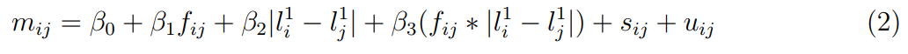
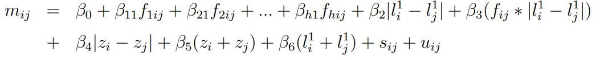

```{r, include=FALSE}
options(tinytex.verbose = TRUE)
```

```{r message=FALSE, results='hide', echo=FALSE, warning=FALSE, include=FALSE}
library(tidyverse)
library(dplyr)
library(yardstick)
library(rticles)
library(ggplot2)
library(mosaic)
library(stargazer)
require(Stat2Data)
library(scales)
library(readr)
library(rms)
library(pastecs)
library(tidyr)
library(stats)
library(haven)
library(kableExtra)
library(params)
library(knitr)
library(pander)
```


```{r import_data, results='hide', echo=FALSE, warning=FALSE, include=FALSE}
vector<- read.csv("Data/tablea1_edit.csv")
grp<-read_dta("Data/grpFFcl.dta")
tablea1<-merge(vector,grp,by = "idgroup")
```


# 1. Introduction

 

# 2. Main paper 

  

   

 
# 3. Reproduction of [ Author Names and date of paper]

  The following section will discuss the reproduction of all the relevant figures, p-values and regression results to gamble choices and group formation experiments presented in the paper. The discussed summary statistics, figures, and regression tables are within the text while  the relevant regression for the mentioned p-values of the logit regression model can be found in the appendix.

The bar chart and all the summary tables in this paper are reproduced successfull and exactly the same. All the regression tables are reproduced successfully but there are some minor differences. For table 5, we are able to reproduce the regressiono model with the same coefficients and very similar marginal effects. However, R and STATA calculate marginal effects differently and R's margins package is not able to generate standard errors when a factor variable is included in the model. Therefore, the marginal effects we present are very closed but not identical. In addition, the linear regression model with clustering we reproduce are a little bit different from the one in the paper since R treats NA differently and drops one more observation than STATA from the data set we are given. Yet the difference is very minimal as most numbers in the regressions are identical and only a few have different second or third digits after decimal point. 

```{r figure1 data, echo=FALSE, warning=FALSE, message=FALSE, include = FALSE}
Dyadic<- read.csv("Dyadic.csv") 
tab1<-Dyadic%>%
  dplyr::filter(inreg == 1 & frfamcl == 1)
tab2<- Dyadic%>%
  dplyr::filter(inreg == 1 & frfamcl == 0)
library(gmodels)
tab11<- as.data.frame(with(tab1, CrossTable(difchoice1, samegroup, missing.include=TRUE,prop.c = FALSE,prop.chisq = FALSE, chisq = FALSE, prop.t = FALSE)))

green<-tab11%>%
  dplyr::filter(prop.col.y == 1)%>%
  select(prop.row.Freq, prop.row.x)%>%
  mutate(type = "Geog. prox. family& friends (4,466)")

tab12<- as.data.frame(with(tab2, CrossTable(difchoice1, samegroup, missing.include=TRUE,prop.c = FALSE,prop.chisq = FALSE, chisq = FALSE, prop.t = FALSE)))

red<-tab12%>%
  dplyr::filter(prop.col.y == 1)%>%
  select(prop.row.Freq, prop.row.x)%>%
  mutate(type = "Other (82,052)")

library(plyr)
table2<-rbind(green,red)
```

```{r, out.width='100%', fig.align='center',  include = TRUE, echo = FALSE}
library(ggplot2)
library(RColorBrewer)
cbPalette <- c("#009E73", "#D55E00", "#CC79A7")
ggplot(table2,aes(x=prop.row.x, y = prop.row.Freq*100, fill = type)) +
  geom_bar(stat="identity",colour="black",position="dodge") + ggtitle("Figure 1: Assortative match with respect to risk attitudes by different types of dyad")+ xlab("Difference in round 1 gamble choice")+  ylab("Select into same group (%)")+scale_fill_manual(values=cbPalette)+theme(legend.position="top",panel.background = element_rect(fill='white', colour='white'))
```


Figure 1 below could be regarded as an informal analysis by visualizing the relationship between grouping choices, risk attitude, and inter-relationship. It shows how the proportion of dyads choosing to group together varies
with the difference in their first round gamble choices and depending on whether they are
close family and friends or not. 

```{r table1 data, echo=FALSE, warning=FALSE, message=FALSE, include = FALSE}
Dyadic_dta<- read_dta("Data/AttanasioEtAl2011Vector.dta")
vector<-read.csv("vector.csv")%>%
  mutate(renegadelose = renegade - renegadewin)

vectorsum1<-vector%>%
  mutate(female = female*100, head = head*100,married = married*100,urbr_2=urbr_2*100,tcons = tcons/1000)%>%
  select(female, yage, ysch, head, married, urbr_2, tcons, lcons, survhhsz, familyoutdeg,friendsoutdeg)%>%
  gather(key = "Vars","Value",female, yage, ysch, head, married, urbr_2, tcons, lcons, survhhsz, familyoutdeg, friendsoutdeg)

vectorsum1<-na.omit(vectorsum1)%>%
  dplyr::group_by(Vars)%>%
  dplyr::summarise_each(funs(Obs = length(Vars),mean_fullsample = mean(Value), sd_fullsample = sd(Value)))%>%
  mutate(round = c(1:11))

vectorsum2 <- vector[vector$insample==1, ]
vectorsum2<-vectorsum2%>%
  mutate(female = female*100, head = head*100,married = married*100,urbr_2=urbr_2*100,tcons = tcons/1000)%>%
  select(female, yage, ysch, head, married, urbr_2, tcons, lcons, survhhsz, familyoutdeg,friendsoutdeg)%>%
  gather(key = "Vars","Value",female, yage, ysch, head, married, urbr_2, tcons, lcons, survhhsz, familyoutdeg,friendsoutdeg)
 
vectorsum2<-na.omit(vectorsum2)%>%
  group_by(Vars)%>%
  dplyr::summarise_each(funs(Obs = length(Vars),mean_sampleanalysed = mean(Value), sd_sampleanalysed = sd(Value)))


table1<-merge(vectorsum1, vectorsum2, by = "Vars")%>%
  mutate(Vars = c("No. of kin recognized in session","Female","No. of friends recognized in session","Household head","Log household consumption per month","Married","Household size","Household consumption ('000 Pesos/month) 2","Lives in municipal centre","Age (years)","Education (years)"))

is.num <- sapply(table1, is.numeric)
table1[is.num] <- lapply(table1[is.num], round, 2)

table1[2,3]<-paste(table1[2,3],"%",sep = "")
table1[4,3]<-paste(table1[4,3],"%",sep = "")
table1[6,3]<-paste(table1[6,3],"%",sep = "")
table1[9,3]<-paste(table1[9,3],"%",sep = "")

table1[2,7]<-paste(table1[2,7],"%",sep = "")
table1[4,7]<-paste(table1[4,7],"%",sep = "")
table1[6,7]<-paste(table1[6,7],"%",sep = "")
table1[9,7]<-paste(table1[9,7],"%",sep = "")

table1[1,4]<-" "
table1[4,4]<-" "
table1[5,4]<-" "
table1[6,4]<-" "


table1[1,8]<-" "
table1[4,8]<-" "
table1[5,8]<-" "
table1[6,8]<-" "

or <- c("2", "10","11","4","6","9","8","5","7","1","3")

table1<-table1%>%
  slice(match(or, round))

table1$round = NULL
```


```{r, results='asis', message = FALSE, warning = FALSE,include=TRUE, echo=FALSE}
kable(table1,format = "latex", col.names = c(" ","Obs.","Mean/Prop","s.d.","Obs.","Mean/Prop","s.d."),booktabs = T)%>%
 add_header_above(c(" " = 1, "Full Sample" = 3,"Sample Analysed" = 3))%>%  kable_styling(latex_options = c("hold_position"), full_width = F,position = "center", font_size = 8)%>%add_header_above(c("Table 1: Experimental subjects"))
```

Descriptive statistics for the experimental participants are presented in table 1 and reflect the fact that only households in the poorest of six income categories defined by the Colombian government are eligible for the financial assistance program, such as FeA that makes cash transfers to households conditional on a pledge from them that all of their children will complete primary school and that the senior woman will attend some nutrition workshops(@). The first and second columns contain the proportions, means, and corresponding standard errors for as many of the 2, 512 subjects as we can match to the survey data in the case of each variable, and the third and fourth columns present the same statistics but for the sample upon which the dyadic regression analysis was ultimately performed. Eighty seven percent were female, 77 percent were married, 29 percent were heads of households. This means that the current experimental results could not be generalized to all sexualities and might contain gender bias. Their average age was 42 years and, on average, they had 3.7 years of education. Thirty-four percent lived in municipal centers where the experimental sessions were conducted, while the remaining 66 percent lived in the surrounding rural clusters. The average monthly household consumption for this sample at the time of the experiments was 430, 000 Colombian Pesos (approximately US$190).


```{r table2 data, echo=FALSE, warning=FALSE, message=FALSE, include = FALSE}
table2<- data.frame(GambleChoice = c("Gamble1", "Gamble2", "Gamble3", "Gamble4", "Gamble5", "Gamble6"),Low = c(3000,2700,2400,1800,1000,0), high = c(3000,5700,7200,9000,11000,12000),exp=c(3000,4200,4800,5400,6000,6000),sd=c(0,2121,3394,5091,7071,8485),riskcalss = c("Extreme","Severe","Intermediate","Moderate","Slight-neutral","Neutral-negative"),crra = c("infinity to 7.49","7.49 to 1.73","1.73 to 0.81","0.81 to 0.46","0.47 to 0.00","0 to -ve infinity"))
```


```{r table 2, results='asis', message = FALSE, warning = FALSE,include=TRUE, echo=FALSE}
#pander(table2, split.cells = 20, split.table = Inf)
kable(table2,format = "latex", col.names = c("Gamble Choice","Low payoff(yellow)","High payoff(blue)","Expected value","Standard Deviation","Risk aversion class","CRRA range"),booktabs = T,align = 'l',caption = "Gamble choices" )%>%kable_styling(latex_options = c("hold_position"),position = "center", full_width = F, font_size = 6)

```
Table 2 presents the expected returns on each gamble and the associated risk appetites. The expected returns vary between 3, 000 and 6, 000
Colombian Pesos.

```{r table3 data, echo=FALSE, warning=FALSE, message=FALSE, include = FALSE}
library(haven)
Dyadic_dta<- read_dta("Data/AttanasioEtAl2011Vector.dta")
vector<-read.csv("vector.csv") %>%
  mutate(renegadelose = renegade - renegadewin)

c1<-as.data.frame(table(vector$choice1))%>%
  mutate(Prop = Freq/sum(Freq))%>%
  spread(Var1, Prop)
colnames(c1) <- paste("gamble",colnames(c1), sep = "_")

c1<-c1%>%
  select(gamble_1, gamble_2, gamble_3, gamble_4, gamble_5, gamble_6)


c1$gamble_1[is.na(c1$gamble_1)] <- c1$gamble_1[!is.na(c1$gamble_1)]

c1$gamble_2[is.na(c1$gamble_2)] <- c1$gamble_2[!is.na(c1$gamble_2)]

c1$gamble_3[is.na(c1$gamble_3)] <- c1$gamble_3[!is.na(c1$gamble_3)]

c1$gamble_4[is.na(c1$gamble_4)] <- c1$gamble_4[!is.na(c1$gamble_4)]


c1$gamble_5[is.na(c1$gamble_5)] <- c1$gamble_5[!is.na(c1$gamble_5)]

c1$gamble_6[is.na(c1$gamble_6)] <- c1$gamble_6[!is.na(c1$gamble_6)]

c1<-c1*100
c1<-data.frame(choice = "choice1", c1)%>%
  gather(key = "gamble", "prop", gamble_1, gamble_2, gamble_3, gamble_4, gamble_5, gamble_6)


c2<-as.data.frame(table(vector$choice2))%>%
  mutate(Prop = Freq/sum(Freq))%>%
  spread(Var1, Prop)
colnames(c2) <- paste("gamble",colnames(c2), sep = "_")

c2<-c2%>%
  select(gamble_1, gamble_2, gamble_3, gamble_4, gamble_5, gamble_6)

c2$gamble_1[is.na(c2$gamble_1)] <- c2$gamble_1[!is.na(c2$gamble_1)]

c2$gamble_2[is.na(c2$gamble_2)] <- c2$gamble_2[!is.na(c2$gamble_2)]

c2$gamble_3[is.na(c2$gamble_3)] <- c2$gamble_3[!is.na(c2$gamble_3)]

c2$gamble_4[is.na(c2$gamble_4)] <- c2$gamble_4[!is.na(c2$gamble_4)]


c2$gamble_5[is.na(c2$gamble_5)] <- c2$gamble_5[!is.na(c2$gamble_5)]

c2$gamble_6[is.na(c2$gamble_6)] <- c2$gamble_6[!is.na(c2$gamble_6)]

c2<-c2*100
c2<-data.frame(choice = "choice1", c2)%>%
  gather(key = "gamble", "prop", gamble_1, gamble_2, gamble_3, gamble_4, gamble_5, gamble_6)

vector2 <- vector[vector$insample==1, ]

c1b<-as.data.frame(table(vector2$choice1))%>%
  mutate(Prop = Freq/sum(Freq))%>%
  spread(Var1, Prop)
colnames(c1b) <- paste("gamble",colnames(c1b), sep = "_")

c1b<-c1b%>%
  select(gamble_1, gamble_2, gamble_3, gamble_4, gamble_5, gamble_6)

c1b$gamble_1[is.na(c1b$gamble_1)] <- c1b$gamble_1[!is.na(c1b$gamble_1)]

c1b$gamble_2[is.na(c1b$gamble_2)] <- c1b$gamble_2[!is.na(c1b$gamble_2)]

c1b$gamble_3[is.na(c1b$gamble_3)] <- c1b$gamble_3[!is.na(c1b$gamble_3)]

c1b$gamble_4[is.na(c1b$gamble_4)] <- c1b$gamble_4[!is.na(c1b$gamble_4)]


c1b$gamble_5[is.na(c1b$gamble_5)] <- c1b$gamble_5[!is.na(c1b$gamble_5)]

c1b$gamble_6[is.na(c1b$gamble_6)] <- c1b$gamble_6[!is.na(c1b$gamble_6)]

c1b<-c1b*100
c1b<-data.frame(choice = "choice2", c1b)%>%
  gather(key = "gamble", "prop", gamble_1, gamble_2, gamble_3, gamble_4, gamble_5, gamble_6)


c2b<-as.data.frame(table(vector2$choice2))%>%
  mutate(Prop = Freq/sum(Freq))%>%
  spread(Var1, Prop)
colnames(c2b) <- paste("gamble",colnames(c2b), sep = "_")

c2b<-c2b%>%
  select(gamble_1, gamble_2, gamble_3, gamble_4, gamble_5, gamble_6)

c2b$gamble_1[is.na(c2b$gamble_1)] <- c2b$gamble_1[!is.na(c2b$gamble_1)]

c2b$gamble_2[is.na(c2b$gamble_2)] <- c2b$gamble_2[!is.na(c2b$gamble_2)]

c2b$gamble_3[is.na(c2b$gamble_3)] <- c2b$gamble_3[!is.na(c2b$gamble_3)]

c2b$gamble_4[is.na(c2b$gamble_4)] <- c2b$gamble_4[!is.na(c2b$gamble_4)]


c2b$gamble_5[is.na(c2b$gamble_5)] <- c2b$gamble_5[!is.na(c2b$gamble_5)]

c2b$gamble_6[is.na(c2b$gamble_6)] <- c2b$gamble_6[!is.na(c2b$gamble_6)]


c2b<-c2b*100
c2b<-data.frame(choice = "choice2", c2b)%>%
  gather(key = "gamble", "prop", gamble_1, gamble_2, gamble_3, gamble_4, gamble_5, gamble_6)
  

c3b<-merge(c2, c2b, all = TRUE)
c3b<-c3b%>%
  group_by(gamble,choice)%>%
  dplyr::summarise(meanprop = mean(prop))%>%
  spread(choice,meanprop)

c3b<-data.frame(round = "2", c3b)

c3<-merge(c1, c1b, all = TRUE)%>%  
  group_by(gamble,choice)%>%
  dplyr::summarise(meanprop = mean(prop))%>%
  spread(choice,meanprop)

c3<-data.frame(round = "1", c3)

gamblechoice<-merge(c3,c3b,all = TRUE)%>%
  mutate(sd_fullsample = " ")%>%
  mutate(sd_sampleanalysed = " ")

colnames(gamblechoice)[colnames(gamblechoice)=="choice1"] <- "mean_fullsample"
colnames(gamblechoice)[colnames(gamblechoice)=="choice2"] <- "mean_sampleanalysed"
colnames(gamblechoice)[colnames(gamblechoice)=="gamble"] <- "Vars"


vectorsum1<-vector%>%
  select(blue1,win1, group, cogrpmem, blue2, renegadelose, renegadewin, win2)%>%
  gather(key = "Vars","Value",blue1,win1, group, cogrpmem, blue2, renegadewin, win2,renegadelose)

vectorsum1<-na.omit(vectorsum1)%>%
  group_by(Vars)%>%
  dplyr::summarise_each(funs(mean_fullsample = mean(Value), sd_fullsample = sd(Value)))%>%
  mutate(round = c(1,2,1,1,2,2,1,2))


#need to fix decimal points

vectorsum2 <- vector[vector$insample==1, ]
vectorsum2<-vectorsum2%>%
  select(blue1,win1, group, cogrpmem, blue2, renegadelose, renegadewin, win2)%>%
  gather(key = "Vars","Value",blue1,win1, group, cogrpmem, blue2, renegadewin, win2,renegadelose)
 

vectorsum2<-na.omit(vectorsum2)%>%
  group_by(Vars)%>%
  dplyr::summarise_each(funs(mean_sampleanalysed = mean(Value), sd_sampleanalysed = sd(Value)))%>%
  mutate(round = c(1,2,1,1,2,2,1,2))


others<- merge(vectorsum1, vectorsum2, all = TRUE)
total<- merge(others, gamblechoice, all = TRUE)
total[[4]] <- as.numeric(total[[4]])
total[[6]] <- as.numeric(total[[6]])
is.num <- sapply(total, is.numeric)
total[is.num] <- lapply(total[is.num], round, 3)
total<-arrange(total,round, Vars)
total[1,4]<- " "
total[9,4]<-" "
total[11,4]<-" "
total[18,4]<-" "
total[19,4]<-" "
total[1,6]<- " "
total[9,6]<-" "
total[11,6]<-" "
total[18,6]<-" "
total[19,6]<-" "
total[1,2]<-" "
total[2,2]<-" "
total[9,2]<-" "
total[10,2]<-" "
total[11,2]<-" "
total[18,2]<-" "
total[19,2]<-" "
total[20,2]<-" "
print(total)

library(formattable)
total[1,3] <- total[1,3]*100
total[1,5] <- total[1,5]*100
total[9,3] <- total[9,3]*100
total[9,5] <- total[9,5]*100
total[10,3] <- total[10,3]/1000
total[20,3] <- total[20,3]/1000
total[10,5] <- total[10,5]/1000
total[20,5] <- total[20,5]/1000
total[[4]] <- as.numeric(total[[4]])
total[[6]] <- as.numeric(total[[6]])
total[10,4] <- total[10,4]/1000
total[20,4] <- total[20,4]/1000
total[10,6] <- total[10,6]/1000
total[20,6] <- total[20,6]/1000
total[11,3] <- total[11,3]*100
total[11,5] <- total[11,5]*100
total[18,3] <- total[18,3]*100
total[18,5] <- total[18,5]*100
total[19,3] <- total[19,3]*100
total[19,5] <- total[19,5]*100


is.num <- sapply(total, is.numeric)
total[is.num] <- lapply(total[is.num], round, 3)

library(kableExtra)

library(dplyr)
total<-total[c(3:8,1,10,9,2,12:17,11,19,18,20:nrow(total)),]

total[["round"]]<- c("Gamble 1(safe)","Gamble 2","Gamble 3", "Gamble 4", "Gamble 5", "Gamble 6(riskiest)","Won gamble in 1st round","Winings 1st round ('000 Pesos)","Joined a group","Number of co-group members","Gamble 1(safe)", "Gamble 2", "Gamble 3", "Gamble 4", "Gamble 5", "Gamble 6(riskiest)","Won gamble in 2nd round","Reneged having won gamble","Reneged having lost gamble","Winnings 2nd round ('000 Pesos)")

total[["Vars"]]<- c("","","", "", "", "","","","","", "", "", "", "", "", "","","","","")

total<-total[,c(2,1,3:ncol(total))]
head(total)
 
total[1:7,3]<-paste(total[1:7,3],"%", sep="")
total[1:7,5]<-paste(total[1:7,5],"%", sep="")
total[9,3]<-paste(total[9,3],"%", sep="")
total[9,5]<-paste(total[9,5],"%", sep="")
total[11:19,3]<-paste(total[11:19,3],"%", sep="")
total[11:19,5]<-paste(total[11:19,5],"%", sep="")

total <- rbind(total,c("Observations", " ", "2506"," ","2321"," "))
colnames(total) =  c(" ","  ","Mean/Prop(Full Sample)","s.d.(Full Sample)","Mean/Prop(Sample Analysed)","s.d.(Sample Analysed)")


row.names(total) <- NULL
total$Vars <- NULL
is.num <- sapply(total, is.numeric)
total[is.num] <- lapply(total[is.num], round, 3)

total[is.na(total)] <- " "
```


```{r table 3, results='asis', message = FALSE, warning = FALSE,include=TRUE, echo=FALSE}
knitr::kable(total,format = "latex", col.names = c("Variables"," ","Mean/Prop","s.d.","Mean/Prop","s.d."), align = 'l',booktabs = T)%>%
 add_header_above(c(" " = 2, "Full Sample" = 2,"Sample Analysed" = 2))%>%  kable_styling(latex_options = c("hold_position"), full_width = F, font_size = 8)%>%add_header_above(c("Table3: Experimental data"=6))%>%pack_rows("Gamble choice 1st round",1,6,bold = T)%>%pack_rows("Gamble choice 2nd round", 11,16,bold = T)
```

Table 3 presents the summary statistics of the experimental data. The first
and second columns contain the proportions, means, and corresponding standard errors
for all 2, 512 participants and the third and fourth columns present the same statistics but
for the sample upon which the dyadic regression analysis was ultimately performed. Overall, there is a shift towards more risk-taking in the second round in which 10 precent more people chose Gamble 5 or 6. In the second round, 85% of the subjects chose to join a group of people to share the risk and the average number of subjects in each group is 5. In addition, eight percent of the people defected most of which left after winning their gambles instead of losing their gambles. 

```{r table4 data, echo=FALSE, warning=FALSE, message=FALSE, include = FALSE}
Dyadic_dta<- read_dta("Data/AttanasioEtAl2011Dyadic.dta")
Dyadic<-read.csv("Dyadic.csv")
Dyadic_mdum<-read.csv("Dyadic_mdum.csv")
Dyadic<-Dyadic%>%
  mutate(stranger = 1 - as.numeric(Dyadic$frfam))
star<-Dyadic
pervar<-c("samegroup","friend2","friendfamily","stranger", "frfam","family2", "friend1", "family1", "frfamcl", "difurban", "diffemale","difmarried")
for (i in pervar) {
star[[i]] <- (as.numeric(Dyadic[[i]]))*100
}


library(dplyr)
Dyadic1 <- Dyadic %>%
  subset(inreg == 1)%>%
  mutate(Observations = 0)%>%
  select(c("samegroup","difchoice1","sumchoice1","frfam","friend2","friendfamily", "family2", "friend1", "family1","stranger","frfamcl", "difurban", "diffemale", "difyage", "difysch", "difmarried","diftcons","difcons", "difhhsize","difwin1","sumurban","sumfemale","sumyage", "sumysch", "nummarried", "sumtcons", "sumcons", "sumhhsize", "sumwin1","Observations"))


Dyadic2 <- Dyadic %>%
  subset(inreg == 1 & frfamcl== 1)%>%
  mutate(Observations = 0)%>%
  select(c("samegroup","difchoice1","sumchoice1","frfam","friend2","friendfamily", "family2", "friend1", "family1","stranger","frfamcl", "difurban", "diffemale", "difyage", "difysch", "difmarried","diftcons","difcons", "difhhsize","difwin1","sumurban","sumfemale","sumyage", "sumysch", "nummarried", "sumtcons", "sumcons", "sumhhsize", "sumwin1","Observations"))

Dyadic3 <- Dyadic %>%
  subset(inreg == 1 & frfamcl== 0)%>%
  mutate(Observations = 0)%>%
  select(c("samegroup","difchoice1","sumchoice1","frfam","friend2","friendfamily", "family2", "friend1", "family1","stranger","frfamcl", "difurban", "diffemale", "difyage", "difysch", "difmarried","diftcons","difcons", "difhhsize","difwin1","sumurban","sumfemale","sumyage", "sumysch", "nummarried", "sumtcons", "sumcons", "sumhhsize", "sumwin1","Observations"))

pervar<-c("samegroup","friend2","friendfamily","stranger", "frfam","family2", "friend1", "family1", "difurban","frfamcl", "diffemale","difmarried")

for (i in pervar) {
Dyadic1[[i]] <- (as.numeric(Dyadic1[[i]]))*100
}


pervar<-c("samegroup","friend2","friendfamily","stranger", "frfam","family2", "friend1", "family1", "difurban","frfamcl", "diffemale","difmarried")

for (i in pervar) {
Dyadic2[[i]] <- (as.numeric(Dyadic2[[i]]))*100
}

pervar<-c("samegroup","friend2","friendfamily","stranger", "frfam","family2", "friend1", "family1", "difurban","frfamcl", "diffemale","difmarried")

for (i in pervar) {
Dyadic3[[i]] <- (as.numeric(Dyadic3[[i]]))*100
}

library(fBasics)
sum1<-basicStats(Dyadic1)[c("Mean", "Stdev"),]
sum1<-data.frame(t(sum1))
sum2<-basicStats(Dyadic2)[c("Mean"),]
sum2<-data.frame(t(sum2))
sum3<-basicStats(Dyadic3)[c("Mean"),]
sum3<-data.frame(t(sum3))

table4<-cbind(sum1,sum2,sum3)
table4[17,1]<-(table4[17,1])/1000
table4[17,2]<-(table4[17,2])/1000
table4[17,3]<-table4[17,3]/1000
table4[17,4]<-table4[17,4]/1000 
table4[26,1]<-table4[26,1]/1000 
table4[26,2]<-table4[26,2]/1000
table4[26,3]<-table4[26,3]/1000
table4[26,4]<-table4[26,4]/1000

is.num <- sapply(table4, is.numeric)
table4[is.num] <- lapply(table4[is.num], round, 3)


table4[1,1]<-paste(table4[1,1],"%",sep = "")
table4[1,3]<-paste(table4[1,3],"%",sep = "")
table4[1,4]<-paste(table4[1,4],"%",sep = "")


table4[4:13,1]<-paste(table4[4:13,1],"%",sep = "")
table4[4:13,3]<-paste(table4[4:13,3],"%",sep = "")
table4[4:13,4]<-paste(table4[4:13,4],"%",sep = "")
table4[16,1]<-paste(table4[16,1],"%",sep = "")
table4[16,3]<-paste(table4[16,3],"%",sep = "")
table4[16,4]<-paste(table4[16,4],"%",sep = "")
table4[1,2]<-" "
table4[4:13,2]<-" "
table4[16,2]<-" "


table4[30,]<-c("86518"," ","4466","82052")

is.num <- sapply(table4, is.numeric)
table4[is.num] <- lapply(table4[is.num], round, 3)

rownames(table4)<-c("Joined same group in round 2(%)", "Difference in gamble choice(round1)","Sum of gamble choices (round 1)", "Friends and family: One or both recognized friendship or kinship(%)","Both recognized friendship(%)","Both recognized kinship(%)","One recognized friendship, other kinship(%)","One recognized friendship(%)", "One recognized kinship(%)", "Stranger(%)","Geographically proximate friends and family(%)","One lives in the municipal centre, one not(%)","Different genders(%)","Difference in age(years)","Difference in education (years)","Difference in marital status(%)","Difference in household consumption ('000s Pesos/month)","Difference in log household consumption per month","Difference in household size","Difference in round 1 winnings ('000 Pesos)","Number who live in the municipal centre","Number of females","Sum of ages (years)","Sum of education (years)","Number married","Sum of household consumption ('000s Pesos/month)","Sum of log household consumption per month","Sum of household sizes","Sum of round 1 winnings ('000s Pesos)","observations")
```


```{r table 4, results='asis', message = FALSE, warning = FALSE,include=TRUE, echo=FALSE}

knitr::kable(table4,format = "latex", col.names = c("Mean/Prop","s.d.","Mean/Prop","s.d."), align = 'l',booktabs = T)%>%
 add_header_above(c(" " = 1, "All dyads" = 2,"Close family and friends" = 1, "Other dyads" =1))%>% kable_styling(latex_options = c("hold_position"), full_width = F, font_size = 6)%>%add_header_above(c("Table4: Experimental data"=5))

```

The summary statistics of the dyadic variables in the logit regression are shown in table 4. We see that 1) nine percent of all the possible within-municipality dyads grouped together. 2) The average difference in gamble choices, as a proxy of risk attitudes difference, was two, meaning that one member of the dyad choosing the modal Gamble 4 and the other choosing
either Gamble 2 or Gamble 6. 3) In ten percent of the dyads one or both of the members recognized that they shared a tie of kinship or friendship. Among them, kinships are more rare than friendships by looking at the propotions, but the overall number of recognizations was still large due to the huge sample size. 4) Table 4 also presents the average differences in and sums of individual
characteristics for the dyads.


```{r table5 data, echo=FALSE, warning=FALSE, message=FALSE, include = FALSE}

Dyadic_dta<- read_dta("Data/AttanasioEtAl2011Dyadic.dta")
Dyadic<-read.csv("Dyadic.csv")
Dyadic_mdum<-read.csv("Dyadic_mdum.csv")
Dyadic<-Dyadic%>%
  mutate(stranger = 1 - as.numeric(Dyadic$frfam))
for (x in 1:70){
name <-paste("mdum",x,sep="")
Dyadic[[name]] <- ifelse(Dyadic$municode == x, 1, 0)
}
Dyadic<-Dyadic %>% mutate_each(funs(factor), starts_with("mdum"))

#generate formula for column 1 of table 5
mdum <- Dyadic[, grepl("mdum", names(Dyadic))]
mdumf<-paste(names(mdum),collapse = '+')
c1_formula <- as.formula(paste("samegroup ~ difchoice1+frfamcl+dcfrfamcl+",mdumf))
print(c1_formula)

library(glmmML)
# c1 <- glmmboot(samegroup ~ difchoice1+frfamcl+dcfrfamcl, cluster = municode,family = binomial, data = Dyadic)
# c1
c1 <- glm(c1_formula,family = binomial(link="logit"), data = Dyadic_mdum)

library("margins")
c1_m<-margins(c1,data = find_data(c1, parent.frame()),variables = c("difchoice1","frfamcl","dcfrfamcl"),type = c("response","link"),vcov = stats::vcov(c1), vce = c("delta", "simulation", "bootstrap",  "none"), iterations = 50L, unit_ses = FALSE, eps = 1e-07)

Dyadic_c3<-Dyadic_mdum %>%
  dplyr::filter(frfamcl==1)
c3_formula <- paste("samegroup ~ difchoice1 + friend2+ friendfamily +family2 +friend1 +difurban +diffemale+ difyage +difysch +difmarried +difcons+ difhhsize +difwin1+ sumchoice1 +sumurban+ sumfemale +sumyage+ sumysch +nummarried +sumcons+ sumhhsize +sumwin1+",mdumf)
c3 <- glm(c3_formula,family = binomial(link="logit"), data = Dyadic_c3)
c3_m<-margins(c3,data = find_data(c3, parent.frame()),variables = c("difchoice1","friend2","friendfamily","family2","friend1"),type = c("response","link"),vcov = stats::vcov(c3), vce = c("delta", "simulation", "bootstrap",  "none"), iterations = 50L, unit_ses = FALSE, eps = 1e-07)
library(miceadds)
Dyadic_c2<-Dyadic_mdum
c2_formula <- paste("samegroup ~ difchoice1 + friend2+ friendfamily +family2 +friend1 +family1 + frfamcl + dcfrfamcl + difurban +diffemale+ difyage +difysch +difmarried +difcons+ difhhsize +difwin1+ sumchoice1 +sumurban+ sumfemale +sumyage+ sumysch +nummarried +sumcons+ sumhhsize +sumwin1+factor(municode)")
c2 <- glm(c2_formula,family = binomial(link="logit"), data = Dyadic_c2, na.action = na.omit)
summary(c2)
c2_m<-margins(c2, data = Dyadic_mdum,variables = c("difchoice1","frfamcl","dcfrfamcl","friend2","friendfamily","family2","friend1","family1"),type = c("response","link"),vcov = stats::vcov(c2), vce = c("delta"), iterations = 50L, unit_ses = FALSE, eps = 1e-07)

Dyadic_c4<-Dyadic_mdum%>%
  dplyr::filter(frfamcl==0)
c4_formula <- paste("samegroup ~ difchoice1 + friend2+ friendfamily +family2 +friend1 +family1+difurban +diffemale+ difyage +difysch +difmarried +difcons+ difhhsize +difwin1+ sumchoice1 +sumurban+ sumfemale +sumyage+ sumysch +nummarried +sumcons+ sumhhsize +sumwin1+",mdumf)
c4 <- glm(c4_formula,family = binomial(link="logit"), data = Dyadic_c4)


c4_m<-margins(c4,data = find_data(c4, parent.frame()),variables = c("difchoice1","friend2","friendfamily","family2","friend1","family1"),type = c("response","link"),vcov = stats::vcov(c4), vce = c("delta", "simulation", "bootstrap",  "none"), iterations = 50L, unit_ses = FALSE, eps = 1e-07)


Dyadic_c5<-Dyadic_mdum%>%
  mutate(dcmaxgpffopt = maxgpffopt*difchoice1)%>%
  dplyr::filter(frfamcl==0)
c5_formula <- paste("samegroup ~ difchoice1 + maxgpffopt + dcmaxgpffopt + difgpffopt + friend2+ family2 +friendfamily +friend1 +family1+difurban +diffemale+ difyage +difysch +difmarried +difcons+ difhhsize +difwin1+ sumchoice1 +sumurban+ sumfemale +sumyage+ sumysch +nummarried +sumcons+ sumhhsize +sumwin1+",mdumf)
c5 <- glm(c5_formula,family = binomial(link="logit"), data = Dyadic_c5)


c5_m<-margins(c5,data = find_data(c5, parent.frame()),variables = c("difchoice1","maxgpffopt","dcmaxgpffopt","friend2","family2","friendfamily","friend1","family1"),type = c("response","link"),vcov = stats::vcov(c5), vce = c("delta", "simulation", "bootstrap",  "none"), iterations = 50L, unit_ses = FALSE, eps = 1e-07)

```


```{r table5 data2, echo=FALSE, warning=FALSE, message=FALSE, include = FALSE}
library(dplyr)
c1m<- as.data.frame(summary(c1_m))%>%
  dplyr::select(AME,factor)

c2m<- as.data.frame(summary(c2_m))%>%
  dplyr::select(AME,factor)


c3m<-  as.data.frame(summary(c3_m))%>%
  select(AME,factor)

c4m<- summary(c4_m)%>%
  select(AME,factor)

c5m<- summary(c5_m)%>%
  select(AME,factor)

colnames(c1m)[colnames(c1m)=="AME"] <- "1"
colnames(c2m)[colnames(c2m)=="AME"] <- "2"
colnames(c3m)[colnames(c3m)=="AME"] <- "3"
colnames(c4m)[colnames(c4m)=="AME"] <- "4"
colnames(c5m)[colnames(c5m)=="AME"] <- "5" 


```

```{r table5 data3, echo=FALSE, warning=FALSE, message=FALSE, include = FALSE}
table5<-merge(x=c1m,y=c2m, by = "factor", all.y = TRUE)

table5<-merge(x=table5,y=c3m, by = "factor", all.x = TRUE)


table5<-merge(x=table5,y=c4m, by = "factor", all.x = TRUE)


table5<-merge(x=table5,y=c5m, by = "factor", all = TRUE)

table5<-table5%>%
  mutate(factor = c("Diff. in gamble choice 1 x Close friends and family","Diff. in gamble choice x Max no. close friends and family options","Difference in gamble choice (round 1)","One recognised kinship","Both recognised kinship","Close friends and family","One recognised friendship","Both recognised friendship","One recognised friendship, other kinship","Max.no of close friends and family options"))

table5<-table5%>%
  mutate(round=1:10)
or <- c("3", "6","1","8","5","4","7","9","10","2")

table5<-table5%>%
  slice(match(or, round))

table5$round = NULL

 is.num <- sapply(table5, is.numeric)
 table5[is.num] <- lapply(table5[is.num], round, 3)

sd<-read.csv("table5_sd.csv")
colnames(sd)[colnames(sd)=="X1"] <- "1"
colnames(sd)[colnames(sd)=="X2"] <- "2"
colnames(sd)[colnames(sd)=="X3"] <- "3"
colnames(sd)[colnames(sd)=="X4"] <- "4"
colnames(sd)[colnames(sd)=="X5"] <- "5" 


library(plyr)
table5_2<-rbind(table5,sd)
table5_2<-arrange(table5_2, factor)
table5_2[duplicated(table5_2$factor),1]<- " "
rownames(table5_2) <- NULL

table5_2<-table5_2%>%
  mutate(round=1:20)


or <- c("11", "12","5","6","7","8","1","2","3","4","17","18","15","16","19","20","13","14","9","10")

table5_2<-table5_2%>%
  slice(match(or, round))

table5_2$round = NULL

table5_3<-read.csv("table5_3.csv")
colnames(table5_3)<-c("factor","1","2","3","4","5")

table5_2<-rbind(table5_2,table5_3)

table5_2[19,6]<-round(c5m[8,1],3)
table5_2<- sapply(table5_2, as.character)
table5_2[is.na(table5_2)] <- " "
```


```{r table 5, results='asis', message = FALSE, warning = FALSE,include=TRUE, echo=FALSE}

#position = "float_right" 
library(kableExtra)
library(params)
library(knitr)
knitr::kable(table5_2,format = "latex", row.names = NA,align = 'c',booktabs = T, col.names = c("","1","2","3","4","5"))%>%add_header_above(c(" " = 1, "All dyads" = 2,"Close friends and family" = 1, "Other dyads" = 2))%>%  kable_styling(latex_options = c("hold_position"), full_width = F, font_size =7)%>%add_header_above(c("Table 5: Dyadic analysis of assortative matching on risk attitudes"=6))%>% add_footnote("Notes: Marginal effects reported. Corresponding standard errors (in parentheses) adjusted to account for non-independence within municipalities by clustering; *** - sig. at 1% level; ** - sig. at 5% level; * - sig. at 10% level. # - 4 additional municipalities were dropped from this regression because, in one, all of the dyads joined the same group and, in three, none of the dyads joined the same group; ## - Controls included: One lives in municipal centre, one not, Different genders, Difference in age, Difference in years of schooling, Difference in marital status, Difference in log household consumption, Difference in household size, Difference in round 1 winnings, Sum of gamble choices,Number who live in municipal centre, Number of females, Sum of ages, Sum of years of schooling, Number who are married (not to each other), Sum log household consumption, Sum of household sizes, Sum of round 1 winnings.", notation="alphabet")
```
Table 5 presents the marginal effects of five logit regressions. In the paper, two models are mainly analyze the test the hypothesis. The first model is:  


```{r, out.width='60%', fig.align='center', include = TRUE, echo = FALSE}

```

The dependent variable is a binary variable indicating whether people join the same group or not. $beta_1$ gives the evidence on whether close family and friends are more likely to group together. $beta_2$ is the difference in gamble choices, which is a proxy of risk attitudes. $beta_3$, one of the most importaant predictors, tells us whether close family and friends assort more strongly with respect to risk attitudes than who are unfamiliar. If its marginal effect is significantly negative, the answer would be yes. This model correponds to the first column in table 5. The result confirms two hypotheses. First, grouping is more likely among close family and friends than the unfamiliar. Second, the significant negative marginal effect of the interaction term indicates that among close family and friends grouping is strongly assortative with respect to risk attitudes and among unfamiliar individuals grouping may or may not be assortative with respect to risk attitudes.

A possible explanation is that being close friends and family is associated with a higher likelihood of grouping gather. Because family and friends are considered more trustworthy than strangers, and people with available connections but group with unfamiliars are suspected of being untructwothy

The second model includes the three variables from model 1 and is added more controls regarding the nature of relationships of friends and kinship. It correponds to second column of table 5.  


```{r, out.width='60%', fig.align='center', include = TRUE, echo = FALSE}

```

The results of the second model support the robustness of the findings of the first model. The additional controls lead to a significant reduction in the size of the marginal effect
of ‘Close friends and family’. While still positive and significant, the marginal effect is less than one fifth of its former size.

In the last column, the third hypothesis is tested and according to the statistical significance of ***Max no. of close friends and family options, we could conclude that the more family and friends are available, unfamiliar dyads are less likely to group together.


```{r tablea1 data, echo=FALSE, warning=FALSE, message=FALSE, include = FALSE}
library(miceadds)
model_formula1 <- as.formula(pdefault ~  grpFFcl.y+grpmem+gch2+gfem+gage+gurb+gysch+gmar+glcons+ghhsz)
tablea1_1<-tablea1%>%
  dplyr::filter(grpmem<=3)

# col1<-lm.cluster(model_formula1,data =tablea1_1,cluster = tablea1_1$municode)
# summary(col1)

#col1<-lm(model_formula1,data =tablea1_1)
#summary(col1)


model_formula2 <- as.formula(pdefault ~grpFFcl.y+grpmem+gch2+gfem+gage+gurb+gysch+gmar+glcons+ghhsz+factor(municode))

col2<-lm(data =tablea1,model_formula2)
summary(col2)

tablea1<-tablea1%>%
  mutate(ffclmem=grpFFcl.y*grpmem)
model_formula3 <- as.formula(pdefault ~  grpFFcl.y+grpmem+ffclmem+gch2+gfem+gage+gurb+gysch+gmar+glcons+ghhsz+factor(municode))

col3<-lm(data =tablea1,model_formula3)
summary(col3)

library(lfe)
col1<- felm(pdefault ~  grpFFcl.y+grpmem+gch2+gfem+gage+gurb+gysch+gmar+glcons+ghhsz|0|0|municode, data= tablea1_1)
```

```{r, results="asis", echo=FALSE, warning=FALSE, message=FALSE}
library(stargazer)
stargazer(col1,col2,col3,covariate.labels =c("1:Density of close friends and family network within group","2:Number of group members","1x2","Average gamble choice","Proportion of females","Average age","Proportion living in municipal centre","Average years of education","Proportion married","Average log household consumption","Average household size","Constant") ,column.labels = c("Groups of 2 or 3","All groups"),keep = c("grpFFcl.y","grpmem","ffclmem","gch2","gfem","gage","gurb","gysch","gmar","glcons","ghhsz","Constant"),title="Table A1: Group-level analysis of defections: Dependent variable = proportion of members that default",omit.stat=c("LL","ser","f"),ci=FALSE, notes =c("Linear regression coefficients reported.","Standard errors (in parentheses)", 
          "adjusted to account of non-independence","within municipalities by clustering"),notes.align = "l",notes.append = TRUE, add.lines =list(c("Municipality dummies","no","no","yes")),rownames = FALSE,intercept.bottom = TRUE, keep.stat = c("n"),dep.var.labels = "Proportion of members that default", t.auto = FALSE,no.space=TRUE,style = "aer",column.sep.width = "0.3pt", font.size = "scriptsize")
```

Other regressions the researchers conduct are simple linear regressions with clustering. They are used to test the assumptions on people's decision to defect (i.e., leave the group) that the predictions of the paper are based on. According to the results from the first (for groups of 2 or 3) and third column (all groups regardless of sizes), the higher the density of within-group friend and family network, the lower the defaults(leaving the group). Moreover, the effect declines with group size.

Although the paper and our reproduction give the same conclusion on the main variables, there is a difference on the statistical significances of the gender and the residence variables. Th paper's results show that proportion of females are important predictor of default rate while ours shows that gender is not significant but the proportion living in the municipal centers is important. To figure out the reason that this difference exists, we use several functions from different packages to conduct the regression, including the lm.cluster() function from the miceadds package, standard lm, and lm with clustering option from the lfe package. They all give the same results (column 1 in the reproducted column 1 of table A1) different from that of the original paper. This means that the original paper might be wrong or STATA an R have different assumptions about the linear regression model with clustering effects. If our model is correct, the more percenatge of subjects that live in non-rural areas like towns and villages, the higher the rate of default. Since we know from the literature review that only people from poor areas would usually need group formation to deal with financial challenges, it is understandable that people from urban areas would have a higher default rate since they lack the incentive to stay and could be comfortable with taking risk by themselves after a period of playing. It is also possible that people from urban areas are more risk averse and lose averse, meaning that urban subjects might be willing to form a group with trustworthy and risk loving person, but want to leave the group when loosing to decrease the risk of sharing his/her own gains. 

# 4. Related literature

  

# 5. Experiment proposal 
 

# Appendix

```{r, eval= FALSE}
library(stargazer)
stargazer(c1,c2,c3,c4,c5,type = "html", column.labels = c("1","2","3","4","5"), column.separate = NULL,dep.var.labels= "Same group",title=" Logit Regression of: Dyadic analysis of assortative mathcing on rosk attitudes Results",align=TRUE, out="table5_models.htm",omit.stat=c("LL","ser","f"),ci=FALSE, ci.level=0.90,no.space=TRUE)

```


# References
